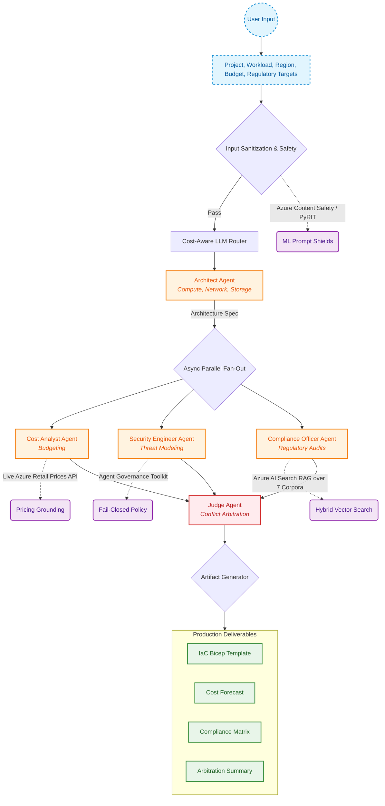

# ☁️ Microsoft CloudOptima

> **Multi-Agent Cloud Architecture Designer** — A production-grade multi-agent AI system that designs, validates, prices, and secures enterprise Azure architectures in plain English.

[](https://www.python.org/)
[](https://streamlit.io/)
[](./docs/rfcs/0001-custom-orchestrator.md)
[](./scripts/redteam/pyrit_redteam.py)
[](./cloudoptima/governance.py)

---

## 📌 Overview

**CloudOptima** automates the end-to-end process of designing enterprise cloud architectures on Microsoft Azure. Instead of manually navigating documentation, pricing calculators, security baselines, and compliance frameworks, users specify their business requirements, workload type, budget, and regulatory targets. 



---

## 🤖 The Five-Agent Pipeline

| Agent | Responsibility | Core Invariant & Safeguard |
|---|---|---|
| **1. Architect Agent** | Designs multi-tier compute, storage, networking, and data infrastructure. | Operates on strict output schemas; never handles raw credentials or API keys. |
| **2. Cost Analyst Agent** | Estimates monthly operational expenditure and suggests cost optimizations. | Grounded in the live **Azure Retail Prices API** and immutable static baselines; budget is read-only. |
| **3. Security Engineer Agent** | Evaluates threats, identity boundaries, network isolation, and encryption. | Findings cannot contain executable code blocks or shell commands. |
| **4. Compliance Officer Agent** | Verifies adherence to regulatory frameworks (GDPR, HIPAA, ISO-27001, NIST, PCI-DSS, PDPL, SOC 2). | Grounded via Hybrid RAG across full legal corpora + 21 immutable core rules. |
| **5. Judge Agent** | Detects pairwise conflicts across agent recommendations and arbitrates trade-offs. | **Hard safety invariant:** Can resolve cost or scale disputes, but **can never disable security controls**. |

---

## 🛡️ Enterprise Security & Responsible AI

CloudOptima integrates real Microsoft frameworks to maintain zero-trust reliability across agent interactions:

- **Microsoft PyRIT (Python Risk Identification Tool):** Automated adversarial red teaming with multi-layer obfuscation (Base64, ROT13, Atbash, Leetspeak, Bidi controls). Gated to an **Attack Success Rate (ASR) of 0.0%**.
- **Azure AI Content Safety & Prompt Shields:** Real ML-based moderation and prompt-shield REST endpoints with defense-in-depth regex fallbacks.
- **Agent Governance Toolkit (AGT):** Fail-closed runtime policy engine enforcing fine-grained tool invocation permissions and tamper-evident audit logging.
- **Model Context Protocol (MCP):** Standardized, read-only FastMCP tool server providing isolated operational utilities for cloud agents.

---

## 🚀 Quick Start

CloudOptima supports running in **Local Offline / Mock Mode** (zero keys required), **Local Multi-Provider Mode** (OpenAI / Anthropic / Gemini / Nvidia), or **Full Enterprise Azure Mode**.

### 1. Installation

```powershell
# Clone the repository
git clone https://github.com/G-Narendra/Microsoft_CloudOptima.git
cd Microsoft_CloudOptima
git checkout dev

# Set up virtual environment
python -m venv .venv
.\.venv\Scripts\Activate.ps1   # On Linux/macOS: source .venv/bin/activate

# Install dependencies
pip install -r requirements.txt
pip install -e .

# Configure environment
Copy-Item .env.example .env     # On Linux/macOS: cp .env.example .env
```

### 2. Launch the Interactive Dashboard

```powershell
streamlit run cloudoptima/dashboard.py
```
*Access the interface at `http://localhost:8501` to configure workload parameters, monitor real-time background agent turns, and download generated artifacts.*

### 3. Run via CLI

```powershell
python -m cloudoptima.app --project "HealthCare Data Platform" --workload realtime --budget 8000 --region eastus --compliance HIPAA
```

> 📖 **Need step-by-step instructions for Azure AI Search, Azure OpenAI, or Docker?**  
> See the complete [Developer & Teammate Setup Guide](./docs/SETUP_GUIDE.md).

---

## 🧪 Testing & Verification

The test suite provides comprehensive coverage across all pipeline layers, security defenses, and concurrency behaviors:

```powershell
# Run the complete test suite
pytest cloudoptima/tests/ -v

# Run the PyRIT adversarial red-teaming campaign
python scripts/redteam/pyrit_redteam.py

# Run the automated quality evaluation harness
python scripts/evaluate/run_evaluation.py
```

---

## 📂 Repository Structure

```
Microsoft_CloudOptima/
├── cloudoptima/                # Core Python package
│   ├── agents/                 # 5 specialized agent implementations
│   ├── compliance/             # RAG engine, 21 immutable rules, Azure AI Search connector
│   ├── policies/               # Agent governance policies (tools.yaml)
│   ├── pricing/                # Live Azure Retail Prices API & static catalog
│   ├── tools/                  # Shared agent tools & registry
│   ├── auth.py                 # RBAC and session authentication
│   ├── context.py              # AppContext dependency container
│   ├── dashboard.py            # Streamlit interactive UI
│   ├── governance.py           # Agent Governance Toolkit (AGT) integration
│   ├── health.py               # System & dependency health checks
│   ├── llm_client.py           # Multi-provider async LLM client
│   ├── llm_routing.py          # Cost-aware intelligent LLM router
│   ├── mcp_server.py           # FastMCP tool server
│   ├── orchestrator.py         # Async 5-agent pipeline & conflict detector
│   ├── safety.py               # Azure AI Content Safety & ML Prompt Shields
│   └── sanitize.py             # Input/output sanitization & rate limiting
├── corpus/                     # Full regulatory text (GDPR, HIPAA, ISO-27001, etc.)
├── docs/                       # Technical documentation & project records
│   ├── SETUP_GUIDE.md          # Step-by-step setup guide for all environments
│   ├── PROGRESS_REPORT.md      # Detailed progress report & Microsoft issues history
│   ├── BUILD_CHECKLIST.md      # Phase-by-phase implementation tracking
│   ├── adr/                    # Architecture Decision Records (ADRs)
│   ├── GITHUB_ISSUES_PROPOSALS.md # Microsoft team feedback & framework solutions
│   └── rfcs/                   # Architecture RFCs (Custom Orchestrator vs MAF/LangGraph)
├── scripts/                    # Evaluation, red teaming, and seeding scripts
├── setup_azure_index.py        # Automated Azure AI Search index schema creator
├── seed_azure.py               # Regulatory corpus chunking & vector seeding tool
├── pyproject.toml              # Build & test configuration
└── Dockerfile                  # Production container definition
```

---

## 👥 Team & Acknowledgments

- **Engineering Team:** Narendra, Andrew, Ivan
- **Collaborating Microsoft Team:** Punit Shah
