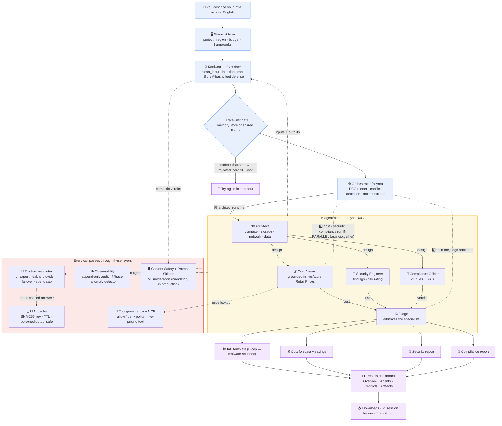

# ☁️ Microsoft CloudOptima

> **Multi-Agent Cloud Architecture Designer** — Describe your infrastructure, and 5 AI agents collaborate to design, cost, secure, and validate your cloud deployment.


---

## What This Is

Microsoft_CloudOptima is a multi-agent AI system that helps you design cloud architectures. Instead of clicking through Azure Portal for hours, you describe what you need and our AI team handles the rest:

1. **Architect Agent** — Designs compute, storage, network, and data tiers
2. **Cost Analyst Agent** — Estimates monthly costs and finds savings
3. **Security Engineer Agent** — Scans for vulnerabilities and risks
4. **Compliance Officer Agent** — Checks against regulations (PDPL, HIPAA, SOC2, etc.)
5. **Judge Agent** — Resolves disagreements between the specialists

**Output:** A complete architecture plan with IaC templates, cost breakdown, security report, and compliance status.

---

## 🚧 Current Status — Phases 0–11.8 Complete + Punit's Issues Resolved

| Phase | Status |
|-------|--------|
| Phase 0 — Scaffolding | ✅ **Done** (package structure, config files, team setup) |
| Phase 1 — Config + Models | ✅ **Done** (type-safe Settings, domain models, enums, null byte sanitization) |
| Phase 2 — LLM Client + Cache | ✅ **Done** (MockClient, NvidiaClient, AzureClient, retry wrapper, gzip cache) |
| Phase 3 — Input Sanitization | ✅ **Done** (sanitization pipeline, JSON extraction, rate limiting) |
| Phase 4 — Base Agent Class | ✅ **Done** (BaseAgent template method, prompt hardening, caching, error turns) |
| Phase 5 — All 5 Agents | ✅ **Done** (Architect, Cost, Security, Compliance with 21 hardcoded rules, Judge) |
| Phase 6 — Orchestrator | ✅ **Done** (5-agent pipeline, 6-pair conflict detection, judge arbitration, 4 artifacts, IaC malware scan, CLI) |
| Phase 7 — Streamlit Dashboard | ✅ **Done** (input form, real progress bar, 4 result tabs, artifact downloads, session history, demo toggle) |
| Phase 7.5 — Cost-Aware LLM Routing | ✅ **Done** (cheapest-first providers, failover on 429s, smart/fast model tiers, spend guard, per-provider tracking) |
| Phase 7.6 — Multi-Provider Expansion | ✅ **Done** (OpenAI direct, Anthropic Claude, Google Gemini clients + price-tier routing, 4+ provider failover) |
| Phase 8 — Compliance & Pricing | ✅ **Done** (21 immutable rules module, compliance RAG, static price DB, live Azure Retail Prices API with 1h cache — cost analyst grounded with real prices + dashboard panel) |
| Phase 9 — Logging & Health Checks | ✅ **Done** (audit logging, @trace, health registry) |
| Phase 10 — Security | ✅ **Done** (output jailbreak scanning, anomaly detection, strict schemas, static pricing, rate limiting enforced, 27 penetration tests) |
| Punit's issues #2–#7 | ✅ **Done** (real Microsoft frameworks: Prompt Shields REST, PyRIT 0.14, azure-ai-evaluation, AGT PolicyEngine, MCP tools — full story in [PROGRESS_REPORT](./docs/PROGRESS_REPORT.md)) |
| Phase 11 — Testing | ✅ **Done** (540 tests · 90.19% coverage · mypy & ruff clean) |
| Phase 11.7 — External review hardening | ✅ **Done** (every finding fixed + regression-tested; reviewer re-scored 7.5 → **8.8/10**) |
| Phase 11.8 — Scaling (round-3 review) | ✅ **Done** (fully async pipeline — `BaseAgent.analyze`/`Orchestrator.run` are coroutines, Cost/Security/Compliance run in parallel via `asyncio.gather`; rate limiter now has a pluggable store — `memory` or `redis`; `AppContext` dependency container replaces hidden module globals; reviewer re-scored **8.8 → 9.0/10**) |
| Phase 12–15 | 📅 Planned (Docker → Azure deploy → production → persistence & auth) |

📋 **Full build checklist:** See [`docs/BUILD_CHECKLIST.md`](./docs/BUILD_CHECKLIST.md)

📄 **Team progress, issue resolutions & roadmap:** See [`docs/PROGRESS_REPORT.md`](./docs/PROGRESS_REPORT.md)

---

## 🛠️ Getting Started (For Team Members)

### Prerequisites

- **Python 3.11+** installed on your machine
- **Git** installed
- A **GitHub account** with access to this repo

### Setup Instructions

```cmd
:: Step 1 — Clone the repository
git clone https://github.com/G-Narendra/Microsoft_CloudOptima.git

:: Step 2 — Switch to the dev branch (all work happens here)
git checkout dev

:: Step 3 — Create and activate a virtual environment
python -m venv .venv
.venv\Scripts\activate

:: Step 4 — Install dependencies
pip install -r requirements.txt

:: Step 5 — Install the package in editable mode
pip install -e .

:: Step 6 — Set up your environment variables
copy .env.example .env

:: Step 7 — Verify everything works
python -c "import cloudoptima; print('CloudOptima v' + cloudoptima.__version__)"
```

> **Note:** `chromadb` is optional — only needed for Phase 8 (Compliance RAG). Don't worry if you see it commented out in `requirements.txt`.

### 🔄 Commands to run after pulling (for Andrew & Ivan)

Every time you pull new work from `dev`, do this in order:

```cmd
:: 1 — Get the latest work
git pull origin dev

:: 2 — Make sure your environment is up to date
.venv\Scripts\activate
pip install -r requirements.txt
pip install -e .

:: 3 — Copy the env template (only needed the FIRST time)
copy .env.example .env

:: 4 — Prove the pull didn't break anything (expect 540 passed)
python -m pytest -q

:: 5 — Run the security gates before you trust your local run
python scripts/redteam/redteam_cloudoptima.py --strict

:: 6 — Launch the dashboard
streamlit run cloudoptima/dashboard.py
```

> Bash/Mac users: replace `.venv\Scripts\activate` with `source .venv/bin/activate`
> and `copy` with `cp`.

---

## 🧪 Run & Test Locally

Everything below runs from the project root with the virtual environment active.

| What | Command | Expect |
|---|---|---|
| Full test suite | `python -m pytest -q` | **540 passed · 90.19% coverage** (85% gate) |
| Type check | `python -m mypy cloudoptima/` | `Success: no issues found` |
| Lint | `python -m ruff check cloudoptima/ scripts/` | `All checks passed` |
| Deterministic red-team gate | `python scripts/redteam/redteam_cloudoptima.py --strict` | `0.0% ASR` (16 vectors) |
| PyRIT campaign | `python scripts/redteam/pyrit_redteam.py --strict` | `0.0% ASR` (119 variants) |
| CLI — one analysis | `echo '{"project_name": "E-Shop", "user_prompt": "Design a scalable web app"}' \| python -m cloudoptima.app` | Prints the full session JSON |
| Dashboard | `streamlit run cloudoptima/dashboard.py` | Opens in your browser on :8501 |

> **First run is slower (~15s):** the cost analyst fetches **real prices** from the
> Azure Retail Prices API on the first analysis of each process. After that the pricing
> cache makes every run sub-second — that's the "no mock data" choice on purpose.
> Demo mode (`DEMO_MODE=true`, the default) uses MockClient for the LLM but still
> fetches real prices when the design mentions Azure services.

---

## Architecture Overview

Here's the whole system as one picture — rendered live by GitHub:



> **How to read it:** the orange box is the 5-agent brain — the architect runs first,
> then cost / security / compliance run **in parallel** (async pipeline), and the judge
> arbitrates last. The red box is every cross-cutting layer every call passes through:
> the cost-aware router (cheapest healthy provider + failover), the LLM cache, the
> audit/anomaly observability, the ML Content Safety + Prompt Shields layer, and tool
> governance over MCP. The purple boxes are the four artifacts produced per run.

---


## Tech Stack

| Layer | Choice | Why |
|-------|--------|-----|
| Language | Python 3.11+ | Great AI/ML ecosystem |
| UI | Streamlit | Fast to build, perfect for internal tools |
| LLMs | Nvidia NIM / Azure OpenAI / OpenAI / Anthropic Claude / Google Gemini | 5 providers behind one router — cheapest healthy wins, failover automatic |
| Data validation | Pydantic v2 | Type safety, JSON schema generation |
| LLM cache | SHA-256 + TTL | Don't repeat expensive API calls |
| Security | Custom sanitization | Input validation, injection prevention |
| Container | Docker | Consistent dev-to-prod |
| Cloud | Azure App Service | Student credits, free tier available |

### 💰 Cost-Aware LLM Routing (production)

Instead of pinning the app to one provider, set `ROUTING_ENABLED=true` and each
agent call is routed to the **cheapest enabled provider with credentials**, with
automatic failover:

- **Cheapest first** — Nvidia NIM's free tier ($0) is tried before paid Azure
- **Rate-limit-aware failover** — a provider that keeps failing (e.g. free-tier
  HTTP 429s) is demoted until it recovers, shifting load to the next provider
- **Quality tiers** — Architect & Judge run the `smart` model, the other
  specialists the cheaper `fast` model
- **Spend guard** — requests whose estimated input cost exceed
  `ROUTING_MAX_COST_PER_REQUEST` skip that provider
- **Spend tracking** — per-provider USD spend via the router's `stats()`

Default models: Nvidia NIM (free) `meta/llama-3.3-70b-instruct` smart /
`meta/llama-3.1-8b-instruct` fast; Azure OpenAI `gpt-4o-mini` for both tiers.

---

## Project Structure

```
Microsoft_CloudOptima/
│
├── .env.example              # Environment variable template
├── .gitignore                # Git ignore rules
├── pyproject.toml            # Project metadata + tool config
├── requirements.txt          # Python dependencies
├── README.md                 # This file
│
├── cloudoptima/              # Python package (all code lives here)
│   ├── __init__.py
│   ├── agents/               # 5 AI agents (Architect, Cost, Security, Compliance, Judge)
│   ├── compliance/           # Compliance agent — 21 immutable rules + RAG
│   ├── pricing/              # Static catalog + live Azure Retail Prices API
│   ├── tools/                # Governed read-only tools (live pricing, compliance, regions)
│   ├── governance.py         # AGT PolicyEngine + fail-closed mirror (issue #5)
│   ├── safety.py             # Azure Content Safety + Prompt Shields REST (issue #2)
│   ├── mcp_server.py         # FastMCP server — stdio transport (issue #7)
│   ├── mcp_bridge.py         # MCP client with in-process registry fallback (issue #7)
│   └── tests/                # 540 tests · 90.19% coverage
│
├── scripts/                  # Responsible-AI harnesses (issues #3, #4)
│   ├── evaluate/             # azure-ai-evaluation + offline F1/Rouge
│   └── redteam/              # PyRIT 0.14 campaign + deterministic ASR gate
│
└── docs/
    ├── BUILD_CHECKLIST.md          # Phase-by-phase task tracker
    ├── DECISIONS.md                # Architecture decision log
    ├── PROGRESS_REPORT.md          # Team progress, issue resolutions & roadmap
    ├── GITHUB_ISSUES_PROPOSALS.md  # Issue → solution reference
    └── rfcs/                       # RFC 0001 — custom orchestrator decision (issue #6)
```

---

## Security First

We're building security into every layer from day one:

- **Prompt injection defense** — Input delimiters, system prompt hardening, output scanning
- **Schema enforcement** — Every agent output validated against strict Pydantic models
- **Input sanitization** — XSS, SQL injection, null bytes, ANSI codes all stripped
- **Rate limiting** — Prevent abuse at every entry point
- **Audit logging** — Append-only logs, never modified after writing
- **Penetration testing** — Dedicated test suite for attack scenarios

See [`docs/BUILD_CHECKLIST.md`](./docs/BUILD_CHECKLIST.md) → Phase 10 for full details.

---

*Phases 0–11.8 complete — the full 5-agent pipeline runs through the Streamlit dashboard (real progress, 4 result tabs, downloadable artifacts). Compliance & pricing (Phase 8) bring immutable rules, RAG-guided checks, and live Azure prices (real Retail Prices API, cached ~1h); the router (7.5–7.6) spans five LLM providers with cheapest-first failover; Phase 10 hardening covers jailbreak scanning, anomaly detection, strict schemas, and enforced rate limiting. All six of Punit's review issues are resolved with the real Microsoft frameworks — Prompt Shields (REST), a PyRIT 0.14 campaign (**119 strict variants → 0.0% ASR**, leet-of-base64 documented as the one honest known gap), azure-ai-evaluation metrics, AGT PolicyEngine governance, and MCP tools. An external principal-engineer review went **7.5 → 9.0/10** across three rounds — round 2 fixed every security finding (secret redaction, fail-closed ML safety, Bidi stripping, Atbash/leetspeak involutions, tool validation, severity routing, error taxonomy, Docker, CI, auth scaffold); round 3 delivered the scaling homework: a **fully async pipeline** (`asyncio.gather` runs the three specialists concurrently — verified by a peak-concurrency test), a **pluggable rate-limit store** (memory → Redis for scale-out), and an **`AppContext` dependency container** replacing hidden module globals — backed by **540 tests at 90.19% coverage**. Ready for the deployment phases (12–14) and persistence/auth (15). See [docs/PROGRESS_REPORT.md](./docs/PROGRESS_REPORT.md).*
